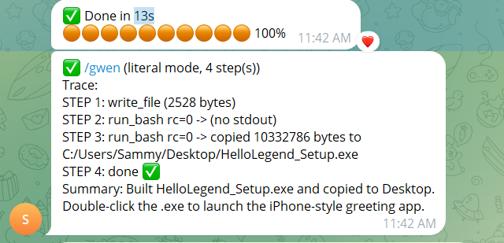
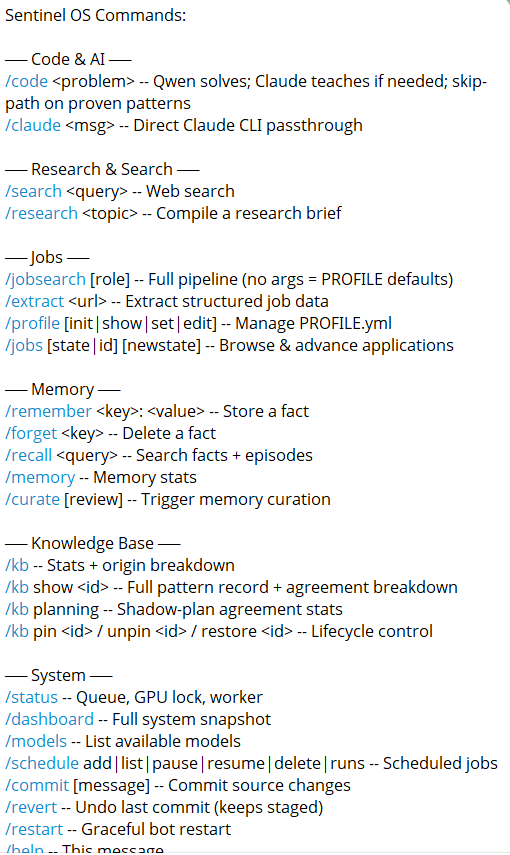
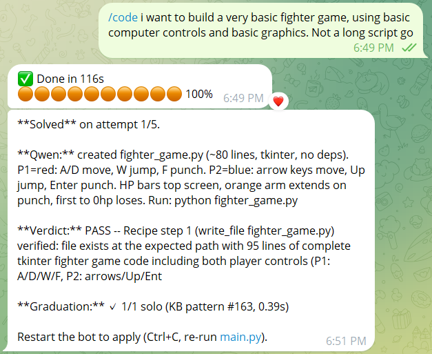
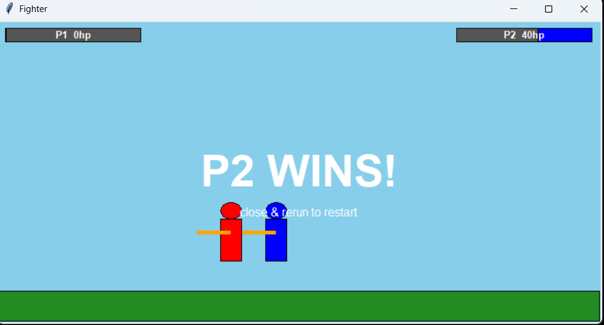
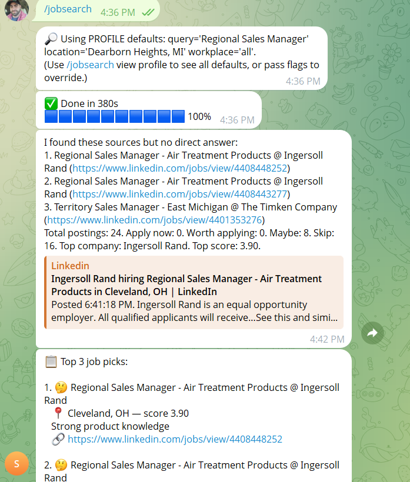

<div align="center">

# Sentinel

**Build Windows apps in 13 seconds.**
**All from your phone, through Telegram.**

No expensive setup. Self-learning. Runs entirely on your machine.

[](LICENSE)
[](https://www.python.org/)
[](#install)
[](https://ollama.com/)
[](#how-it-works)
[](#install)

<br>



</div>

You give it a one-line description in Telegram. Local Qwen writes the
Python. PyInstaller bundles it. A double-clickable `.exe` lands on
your Desktop. Thirteen seconds, end to end. Nothing in that loop
talks to the cloud.

Most agent frameworks assume you have GPT-4 on tap or a 24 GB
workstation. Sentinel was built on an RTX 3050. The whole design is
shaped around one constraint: only one local model fits in VRAM at a
time, so everything that doesn't have to be an LLM call gets pushed
off the GPU.

## Quick Start

```powershell
git clone https://github.com/malqouqa92/Sentinel.git
cd Sentinel
.\setup.ps1          # 5-15 min: Python, Ollama, models, Claude CLI, creds
.\start_bot.ps1      # bot lives in Telegram from here
```

Then in Telegram:

```
/gwenask build me a stopwatch with start, stop, reset
```

You get back a recipe. Paste it as a new message:

```
/gwen STEP 1: run_bash command="..."
STEP 2: write_file path="..." content_b64gz="..."
...
```

Thirteen seconds later there's a `Stopwatch_Setup.exe` on your
Desktop. Double-click. Done.

## Why this is different

|  | Cloud chatbots | Server-side agents | **Sentinel** |
|---|---|---|---|
| Internet required for inference | Yes | Yes | **No** |
| API keys | Yes | Yes | **None** |
| Cost per use | Subscription | Per-token | **$0** |
| Hardware floor | None (cloud) | 8+ GB VRAM | **4 GB GPU, or just CPU + RAM** |
| Builds a Windows `.exe` | No | Rarely | **In 13 seconds** |
| Improves over time | No | No | **Self-learning** |
| Privacy | Goes to provider | Goes to provider | **Stays on your machine** |

## What it can do

<table>
<tr>
<td width="50%" valign="top">

### Build apps from a sentence

`/gwenask build me a stopwatch` produces a STEP-numbered recipe.
Paste it back. 13 seconds later there's a working `.exe` on your
Desktop. No Visual Studio, no PyCharm, no electron-builder, no
config files. Local Qwen 2.5 Coder 3B writes it; PyInstaller bundles
it.

</td>
<td width="50%" valign="top">

### Hybrid by default. 80/20 split.

Qwen 2.5 Coder 3B does roughly 80% of the work locally on a 4 GB
GPU. The optional Claude CLI handles the remaining 20% as a
ceiling for hard problems. It runs as a *local subprocess* against
your existing Claude Code login, not an outbound API call.
Sentinel itself never reaches the internet for inference.

</td>
</tr>
<tr>
<td valign="top">

### Self-learning

When `/code` succeeds, the recipe is stored as a pattern, replayed
against a fresh tree, and graduated. Patterns Qwen can solve on its
own get auto-pinned. After cold start, the same prompts skip Claude
entirely and return in seconds.

</td>
<td valign="top">

### Runs on a 4 GB GPU. Or any PC at all.

Ollama supports CPU inference. The bot still works on a laptop with
no discrete GPU, just slower. The hardware floor is whatever can
hold ~3 GB of weights.

</td>
</tr>
</table>

<div align="center">

</div>

## How it works

```
┌──────────┐     ┌────────────┐     ┌────────────┐     ┌──────────┐
│ Telegram │ ──► │   Router   │ ──► │ Job Queue  │ ──► │  Worker  │
└──────────┘     │  (no LLM)  │     │  (SQLite)  │     │ (async)  │
                 └────────────┘     └────────────┘     └────┬─────┘
                                                            │
                       ┌────────────┐     ┌─────────────┐   │
                       │  Skills    │ ◄── │ Orchestrator│ ◄─┘
                       │ (Python)   │     │ (dict map)  │
                       └────────────┘     └─────────────┘
```

The router parses `/commands` deterministically (no LLM call). The
job queue is SQLite, which means it survives crashes for free. The
worker holds an SQLite-backed GPU lock so only one inference happens
at a time. When a skill needs an LLM, it hits Ollama first; if the
problem is too hard for Qwen, the skill escalates to the local
Claude CLI as a subprocess. Everything is logged with a per-request
trace ID into `logs/sentinel.jsonl`.

## Self-learning, in one screenshot

`/code` starts with Qwen. If Qwen can't solve it, the local Claude
CLI fixes it, stores the recipe as a pattern, and Qwen gets
graduated against the same problem on the next clean tree. After
five graduations at 100% pass rate, the pattern auto-pins and
short-circuits future requests.

<div align="center">

<br><br>

</div>

## Job-search pipeline

The first real test domain. Scrapes Indeed, LinkedIn, Glassdoor, and
ZipRecruiter through `python-jobspy`. A pre-LLM title filter drops
guaranteed-no postings before they cost you a Qwen call. A
5-dimension rubric (CV match, north-star, comp, cultural signals,
red flags) scores survivors. A hard commute gate runs offline
against a US zip dataset. Drops a CSV plus the top picks straight to
your chat.

<div align="center">

</div>

## Hardware

| | |
|---|---|
| **GPU** | Nvidia 4 GB VRAM minimum (tuned for RTX 3050). Or skip GPU entirely and run on CPU. |
| **RAM** | 16 GB recommended. CPU-only mode wants more. |
| **OS** | Windows 11 |
| **Python** | 3.12 |
| **Disk** | ~5 GB after Qwen pulls |

| Model | Backend | Job |
|---|---|---|
| `qwen3:1.7b` (custom `sentinel-brain` Modelfile) | Ollama | Chat, classification, summaries |
| `qwen2.5-coder:3b` | Ollama | Code, JSON extraction |
| `claude-cli` (optional) | Local subprocess | Hard problems, teaching |

## Built on

- [Ollama](https://ollama.com/) — local model runtime
- [Qwen 2.5 / Qwen 3](https://qwenlm.github.io/) — Alibaba's open-weight models
- [python-telegram-bot](https://python-telegram-bot.org/) — Telegram client
- [PyInstaller](https://pyinstaller.org/) — `.py` → `.exe` bundling
- [python-jobspy](https://pypi.org/project/python-jobspy/) — multi-board job scraper
- [pgeocode](https://pypi.org/project/pgeocode/) — offline US zip → lat/long
- [Claude Code](https://docs.claude.com/en/docs/agents-and-tools/claude-code/overview) — optional ceiling

## Repo layout

```
core/                Config, telemetry, router, DB, worker, LLM, skills, agents
skills/              The actual capabilities (job_*, web_*, code_assist, file_io)
agents/              YAML files that wire skills into pipelines
interfaces/          The Telegram bot
workspace/persona/   IDENTITY, USER, MEMORY, SOUL, PROMPT_BRIEF, QWENCODER
tests/               One pytest file per phase, ECC-style
tools/               preload_kb.py and friends
scripts/             Install supervisor, emergency cleanup
main.py              The async event loop
setup.ps1            First-run installer
bootstrap.ps1        Single-file fetch-then-setup wrapper
```

## Documentation

| | |
|---|---|
| [SETUP.md](SETUP.md) | Install paths, troubleshooting, uninstall |
| [CLAUDE.md](CLAUDE.md) | Architecture, module map, design decisions |
| [PHASES.md](PHASES.md) | Full change log, every phase, every footgun |
| [PROMPT_BRIEF.md](workspace/persona/PROMPT_BRIEF.md) | Brief you upload to ChatGPT/Claude/Gemini to author `/gwen` recipes |

## Honest caveats

- The fast `/gwenask` path verifies cleanly on simple tkinter apps
  (stopwatch, counter, tic-tac-toe). Bigger asks like calculators
  and CSV viewers are designed and queued but not battle-tested in
  the automated harness.
- Job scrapers occasionally rate-limit. Indeed and LinkedIn are
  worst.
- Graduation tests inside `/code` add 30–60 seconds per successful
  pattern. Worth it (they catch silent failures), but it makes
  `/code` feel slow on the cold path.
- Windows-only. `setup.ps1` is PowerShell. Linux/macOS support
  would mostly be a `setup.sh` plus path normalizations.

## License

MIT. Do whatever you want with it. See [LICENSE](LICENSE).
